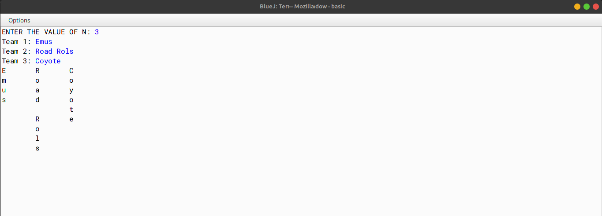

\pagenumbering{gobble}

# ALGORITHM

- Step-1 :- START
- Step-2 :- Create a class named as `banner`.
- Step-3 :- Create a method named as `main`. In this function, create a variable named as `n` to store the value of the numbers of team participating. Create an array of type String named as `teams` of size `n`, create another variable of type int named as `highLen` and initialize it to 0. Now using the for loop take the input of the names of the teams and store it in the array `teams`, after each input check if the length of the input is greater than the value of `highLen` if yes then update the value of `highLen` to the length of the input. Now create a nested for loop and within which compare the variable of loop 1 with `len` (which stores the length of the string at the current index), if true print a blank line else print the letter of the string at the current index. Repeat the process until the loop ends.
- Step-4 :- END

# VD TABLE

| Sr. No. | Variable | Data Type | Description |
| --- | --- | --- | --- |
| 1 | n | int | To store the value of the numbers of team participating. |
| 2 | teams | String[] | To store the names of the teams. |
| 3 | highLen | int | To store the length of the longest string. |
| 4 | len | int | To store the length of the string at the current index. |
| 5 | i | int | Used in for-loop |
| 6 | j | int | Used in for-loop |

# OUTPUT

