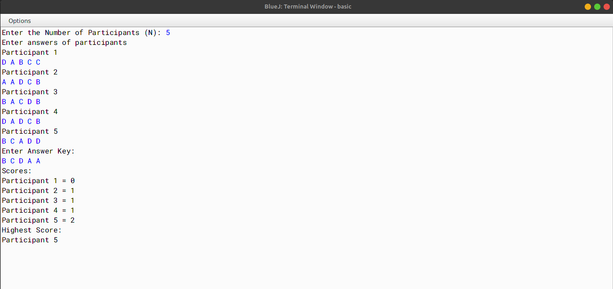

\pagenumbering{gobble}

# ALGORITHM

- Step-1 :- START
- Step-2 :- Create a class named as `quiz`.
- Step-3 :- Create a method named as `main`. In this function, declare a Scanner variable named as `sc` and initialize it with `new Scanner(System.in)`. Now using the `sc` variable, take the input of the number of participants in the quiz in a variable named as `n`. Create two arrays named as `answers[][]` and `key[]` of size `n` and of type `char` respectively. Using two for loops (from 0 to n-1), take the input of the answers of the participants in the `answers[][]` array and the correct answers in the `key[]` array. Now, using two for loops (from 0 to n-1), compare the answers of the participants with the correct answers storing them in an array `score[]` and print the number of correct answers of each participant. Now, compare each score with the maximum score and print the number of participants who have scored the maximum score. Now Print the number of participants who have scored the maximum score.
- Step-4 :- END

# VD TABLE

| Sr. No. | Variable | Data Type | Description |
| --- | --- | --- | --- |
| 1 | n | int | Number of participants in the quiz |
| 2 | answers[][] | char | Array to store the answers of the participants |
| 3 | key[] | char | Array to store the correct answers |
| 4 | score[] | int | Array to store the number of correct answers of each participant |
| 5 | hscore | int | Variable to store the maximum score |
| 6 | i | int | To store the index of the array |
| 7 | j | int | To store the index of the array |

# OUTPUT

