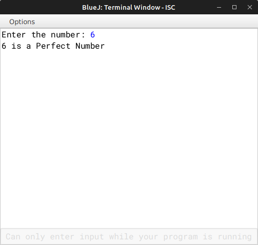

\pagenumbering{gobble}

# ALGORITHM

- Step-1 :- START
- Step-2 :- Create a class named as `"Perfect"`.
- Srep-3 :- Create a parameterized constructor to initialize the instance variable int *num* and *f* with *nn* and *1* recpectively.
- Step-4 :- Create a *int* method `"sum_of_factors(int i)"` to sum up all the factors of a int *i*.
- Step-5 :- Create a *void* method `"check()"` to check the original no. is equal to the sum of factors of the no., and print the appropriate message.
- Step-6 :- Create the `"main"` to input the no. and pass it to the constructor and make a object and call the *check()* funtion.
- Step-7 :- END

# VD TABLE

| Sr. No. | Variable | Data Type | Description |
| --- | --- | --- | --- |
| 1 | num | int | Store the input no. |
| 2 | f | int | Increment variable for the no., to find all its factors |
| 3 | n | int | Stores the user input no. int the *main* method |

# OUTPUT

